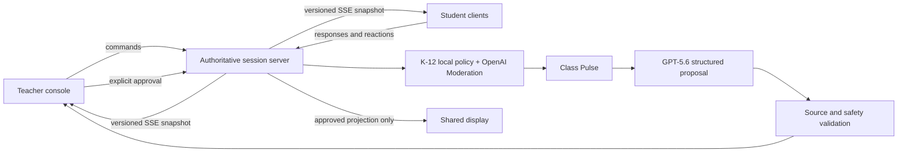

# ClassTrek

> Little steps. One big learning journey. Together.

A source-grounded, teacher-controlled classroom that adapts to student thinking
in real time.

**OpenAI Build Week track:** Education

Interactive lesson products usually make prepared slides more engaging.
ClassTrek makes the **lesson path itself responsive**: students react and
explain their thinking, the class pulse changes live, GPT-5.6 proposes a
source-grounded next teaching move, and the teacher decides whether it reaches
the room.

The demo includes three middle-school science Treks—Mars survival, coral reef
resilience, and rainforest water cycles—with one fully verified live
classroom path.

## Live demo

- App: <https://class-trek.vercel.app>
- Teacher: <https://class-trek.vercel.app/teacher>
- Student: <https://class-trek.vercel.app/join/MARS24>
- Shared display: <https://class-trek.vercel.app/display/MARS24>
- Repository: <https://github.com/Hwoo34/class-trek>

The public demo uses the class code `MARS24`. Use **Reset demo** in the teacher
console before a clean walkthrough. The teacher access code is supplied in the
private Devpost judge instructions. The fallback keeps the lesson usable when
live model access is unavailable and is always labeled; the judging path is
configured to use GPT-5.6.

## What works

- Three synchronized surfaces: teacher console, student device, and shared
  classroom display.
- A server-authoritative session with monotonic versions.
- Live updates over Server-Sent Events, with periodic canonical snapshot checks.
- Student join, confidence reaction, choice, and written reasoning.
- A privacy-preserving aggregate class pulse.
- Local K-12 guardrails plus OpenAI Moderation when API quota is available.
- `safe`, `review`, and `blocked` handling; blocked content never enters the
  aggregate or class display.
- Teacher approval for held student responses and public sharing.
- GPT-5.6 structured next-scene generation restricted to the source pack
  selected for the current Trek.
- Source ID validation and a deterministic, teacher-reviewed fallback when the
  AI service is unavailable.
- Stale-version rejection when a teacher approves an AI proposal.
- Pause, resume, dismiss, regenerate, publish, and deterministic demo reset.
- A sample **Trek Exchange** with reviewed teacher, organization, and
  student-made Treks; ranking/review metadata; topic filters; and a functional
  teacher remix flow that preserves the approved source pack.
- Automated guardrail and class-pulse tests.

## Try the golden path

Start the app and open three browser windows:

| Surface | URL | What to do |
|---|---|---|
| Teacher | <http://localhost:3000/teacher> | Monitor the pulse, review safety decisions, ask AI to read the room, approve the next scene |
| Student | <http://localhost:3000/join/MARS24> | Join with a nickname, react, choose, and explain |
| Shared display | <http://localhost:3000/display/MARS24> | Watch approved ideas and scenes synchronize |

The demo class code is `MARS24`. Use **Reset demo** in the teacher console to
return to a clean state.

## Setup

### Requirements

- Node.js 20+
- pnpm 10+
- An OpenAI API project with quota when testing live GPT-5.6 generation

### Install and run

```bash
pnpm install
cp .env.example .env.local
pnpm dev
```

Add the following values to `.env.local`:

| Variable | Required | Description |
|---|---:|---|
| `OPENAI_API_KEY` | For live AI | Server-only OpenAI project key. Never commit it. |
| `OPENAI_MODEL` | No | Defaults to `gpt-5.6-terra`. |
| `TEACHER_ACCESS_CODE` | Hosted demo | Server-only code required for teacher controls and AI generation. |
| `AI_PROVIDER` | No | `openai`, `lmstudio`, or `fallback`. Defaults to OpenAI when a key exists. |
| `MODERATION_PROVIDER` | No | `openai` for the judging demo or `local` for cost-free local testing. |
| `LM_STUDIO_BASE_URL` | For local AI | Defaults to `http://127.0.0.1:1234/v1`. |
| `LM_STUDIO_MODEL` | For local AI | Defaults to `google/gemma-4-e4b`. |

If the API is unavailable, the lesson still runs with an explicitly labeled,
source-grounded fallback proposal. This is a safety and continuity feature,
not a simulated claim of a successful model response.

### Cost-free local AI testing

ClassTrek supports LM Studio through its OpenAI-compatible Chat Completions
endpoint with JSON-schema-constrained output.
Load `google/gemma-4-e4b`, start the local server, and launch the app with:

```bash
AI_PROVIDER=lmstudio MODERATION_PROVIDER=local pnpm dev
```

This local adapter is for development and failure testing. The final judging
demo uses the separate OpenAI adapter with GPT-5.6. Unit tests default to the
deterministic fallback even when an API key exists, preventing accidental
credit usage.

### Quality checks

```bash
pnpm test
pnpm lint
pnpm build
```

## Architecture



Locally, the prototype stores the sample session in a process-level singleton
and an ignored, atomically replaced `.runtime` checkpoint. On Vercel, the same
adapter writes the canonical snapshot to regional Runtime Cache so separate
Function instances can recover it. Every accepted action increments
`session.version`; clients receive the snapshot over SSE and periodically
verify it over HTTP.

AI work happens after student input has passed the safety boundary. GPT-5.6
receives:

- the approved learning objective;
- the current scene;
- de-identified safe responses;
- aggregate class pulse; and
- excerpts from the approved source pack.

It returns a strict JSON scene proposal. The server rejects source IDs that are
not in the teacher-approved pack. The proposal remains private until a teacher
approves its current version.

## Safety and teacher authority

The AI is a co-host, not the classroom authority.

- Student free text is checked before analysis.
- Blocked text is excluded from the pulse and never sent to the class display.
- Sensitive or uncertain text is held for teacher review.
- A teacher may approve a held learning response, but cannot publish a blocked
  response.
- Only teacher-selected, safe responses can be displayed, and they are shown
  without student identity.
- GPT-5.6 may propose a branch but cannot advance the lesson.
- Every generated factual scene must reference an approved source.
- An AI or moderation outage fails closed and leaves the current lesson usable.
- Hosted teacher commands require a server-verified access code.
- Requests are limited by hashed network fingerprint and action type; GPT
  generation is capped at four requests per 10 minutes per client and 20 per
  day across the demo.

The demo intentionally collects no email, age, location, voice, camera, or
persistent student profile. Nicknames and responses live only in the running
demo state.

Detailed contracts and test cases are in
[`docs/SAFETY_AND_PRODUCT.md`](docs/SAFETY_AND_PRODUCT.md).

## Why this is not another quiz or slide generator

Kahoot, Quizizz, Nearpod, and Curipod already demonstrate the value of
interactive questions and live feedback. This project does not claim those
features as novel.

Its product unit is the **teacher-governed live branch**:

1. the whole class creates a shared pulse;
2. the pulse changes the AI's proposed explanation or question;
3. the proposal is bound to teacher-approved evidence;
4. the teacher approves or rejects the branch; and
5. every connected surface moves to the same version.

## Trek Exchange

ClassTrek treats a lesson story as a remixable **Trek**, not a locked slide
deck. The working demo lets a teacher browse reviewed Treks, filter
student-made contributions, adapt the title and learning goal, and launch the
remix while keeping its approved sources attached.

The ratings, review totals, and creator profiles in this hackathon build are
sample catalog data. A production exchange would add authenticated publishing,
real community reviews, moderation queues, version history, attribution, and
institution-level approval. Student-made Treks would remain private until a
teacher or institution approves them for classroom use.

## How we collaborated with Codex

Codex was used throughout the build rather than as a one-off code generator.

### Where Codex accelerated the work

- Read and compared the official hackathon rules, live submission fields,
  announcements, and judging criteria.
- Researched the competitive boundary around Claude for Teachers, Curipod,
  Nearpod, Kahoot, Quizizz, and ClassPoint.
- Turned the product idea into explicit safety, source-grounding, real-time,
  and teacher-approval contracts.
- Coordinated specialist agents for education safety, real-time architecture,
  and Devpost submission review.
- Implemented the teacher, student, and shared-display surfaces plus their
  server-authoritative event flow.
- Built and tested local guardrails, moderation fallback, class-pulse
  aggregation, structured AI output, and stale approval handling.
- Ran three independent Chrome contexts end to end and used the findings to
  fix edge cases.
- Found a pluralization gap in a local violence keyword test and corrected the
  rule.
- Found that moderation service failure held all free text for review, then
  added a teacher approval path so a lesson can safely continue.
- Found a production-only 20-second GPT timeout, raised the bounded request
  window, and verified a structured GPT-5.6 response in 23.1 seconds.
- Found that long-lived SSE requests reached the Function limit, then changed
  streams to rotate cleanly at 50 seconds with automatic snapshot recovery.
- Found an intermittent truncated structured response and then an unsupported
  tuple schema from the first parser hardening pass. Replaced manual parsing
  with the OpenAI SDK's Zod parser, emitted a supported fixed-length array
  schema, added a regression test, and re-verified a real `gpt-5.6` proposal in
  production.

### Human product, engineering, and design decisions

The human team retained the key decisions:

- Build a responsive whole-class lesson, not a generic tutor or quiz.
- Keep the teacher as the publishing authority.
- Share aggregate thinking instead of a public individual leaderboard.
- Treat source grounding and safety as product behavior, not prompt wording.
- Offer three curated Treks while keeping one fully verified Mars golden
  path for reliable judging.
- Use an editorial, classroom-scale interface rather than a chatbot layout.
- Keep deterministic fallbacks honest and visible.

### How GPT-5.6 contributes

The judging deployment configures `gpt-5.6` for the non-trivial step that
follows a live class response window: it synthesizes de-identified reasoning
and the class pulse into one next-scene proposal under a strict JSON schema.
The proposal must use the approved source IDs and remains private until teacher
approval.

GPT-5.6 does not moderate student text, control the session, select arbitrary
web sources, or publish directly. Those boundaries are enforced in application
code.

## Verification evidence

The current browser verification runs separate teacher, student, and shared
display contexts. It confirmed:

- a student joined and submitted a grounded response;
- a deliberately unsafe response was blocked;
- the teacher received the private moderation result;
- a next-scene proposal appeared in teacher review;
- the display version advanced exactly once after approval; and
- the student and display moved to the same new scene.

The production run additionally confirmed a proposal labeled `gpt-5.6` with
three server-validated source IDs, three structured choices, and a teacher-only
review boundary. The request completed in 23.1 seconds; after approval,
teacher, student, and display surfaces converged on version 24.

The suite currently has 26 passing tests across guardrails, provider selection,
class-pulse aggregation, and monotonic session recovery. Provider-selection
tests also verify that unit tests cannot accidentally spend OpenAI credits. The
production build and lint checks pass.

## Prototype boundaries

- The deployed demo uses Vercel Runtime Cache as a shared, 30-day checkpoint;
  it is an ephemeral cache, not a durable student-record database.
- A school production release still needs durable storage, identity-backed
  individual teacher accounts, participant rate limiting, and a shared event
  bus for horizontal scaling. The hosted judge demo currently uses a signed,
  HttpOnly teacher session derived from its server-only access code.
- The prototype uses SSE with polling fallback rather than a managed realtime
  service.
- The keyword guardrail is a deterministic first layer, not a replacement for
  policy evaluation or school safeguarding procedures.
- No classroom efficacy claim is made without a real study.
- Live GPT-5.6 generation requires API quota; the fallback is clearly labeled.

The production-hardening plan and acceptance suite are documented in
[`docs/REALTIME_TECHNICAL.md`](docs/REALTIME_TECHNICAL.md).

## Repository and submission safety

- `.env.local` and all `.env.*` files are ignored.
- `.env.example` contains variable names only.
- No student data or API secrets belong in issues, commits, screenshots, demo
  videos, or Devpost fields.
- If the repository is private, share judge access with
  `testing@devpost.com` and `build-week-event@openai.com`.

See [`docs/DEVPOST_SUBMISSION.md`](docs/DEVPOST_SUBMISSION.md) for the
submission checklist and user-owned missing fields.

Public demo video:
[ClassTrek: A Live AI Learning Trek Shaped by the Whole Class](https://youtu.be/Tn5JbPUIx44).

## Sources and assets

- ClassTrek is publisher-neutral: a teacher can select a curated source pack
  appropriate to the subject. The demo uses public science material from
  [NASA Science](https://science.nasa.gov/mars/facts/) for the Mars and
  rainforest Treks and
  [NOAA Ocean Service](https://oceanservice.noaa.gov/facts/coral_bleach.html)
  for the reef Trek.
- These organizations provide source material only. They do not endorse,
  review, or sponsor ClassTrek and are not responsible for its AI-generated
  output.
- The interface uses original CSS illustration and open-source Lucide icons.
- No real student data is included.

## License

MIT. See [`LICENSE`](LICENSE).
