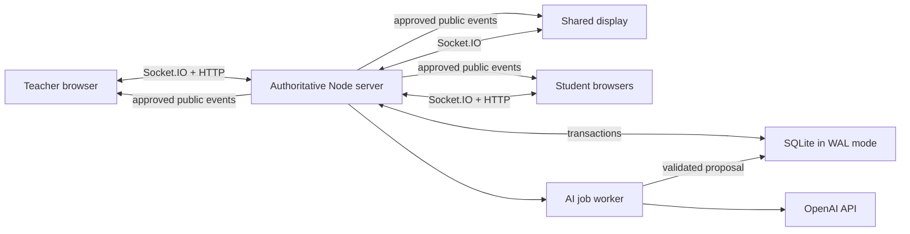

# Real-time classroom technical specification

## Purpose

This document specifies a buildable hackathon prototype in which one teacher,
one shared classroom display, and many students participate in the same live
lesson. The implementation must demonstrate real multi-client coordination,
not a prerecorded animation:

- students join and respond concurrently;
- every screen observes one authoritative lesson state;
- reconnecting clients recover without duplicating actions;
- AI analysis runs asynchronously and cannot advance the lesson by itself;
- only the teacher can publish a new scene or a student contribution;
- unsafe content never reaches the shared display;
- a repeatable load simulation and acceptance suite prove these properties.

The recommended prototype avoids an external managed database. It runs as one
long-lived Node.js process with Next.js, Socket.IO, and a local SQLite database
in WAL mode. Deploy it on a host that supports a persistent Node process and
WebSockets (for example, a small VM or container host), not a serverless
function platform. For judging, keep a checked-in deterministic demo fixture
and a one-command local mode.

## Scope and deliberate constraints

Build one excellent live lesson rather than a general learning-management
system.

- One server process.
- One teacher per live session.
- One shared display per live session, with extra displays allowed as read-only
  mirrors.
- Target: 30 students; verified burst target: 100 simultaneous students.
- Text, multiple choice, confidence, and reaction inputs only.
- No student accounts. A signed, session-scoped guest token identifies a
  generated participant ID.
- No audio/video upload or recording.
- AI may propose content, classify responses, and summarize the class. It may
  never publish, move the lesson forward, or expose a raw student response.
- Teacher identity for the demo is a signed host token created when the lesson
  is launched.
- A single server instance is intentional. Horizontal scaling is out of scope
  because it would require a shared message broker and database.

## Concrete stack

| Concern | Prototype choice | Reason |
|---|---|---|
| Web application | Next.js App Router + TypeScript | Teacher, display, and student surfaces share types and UI primitives |
| Long-lived server | Custom `server.ts` using Node HTTP | Owns both Next.js and the WebSocket server |
| Real-time transport | Socket.IO WebSocket with polling fallback | Rooms, acknowledgement callbacks, reconnect support |
| Durable state | SQLite + WAL, using `better-sqlite3` | Transactional, simple, inspectable, no managed service |
| Validation | Zod | Runtime validation and shared inferred TypeScript types |
| IDs | UUIDv7 or ULID | Unique, sortable event and command IDs |
| Authentication | Signed HttpOnly host cookie; signed guest token | Prevents clients from claiming teacher authority |
| AI jobs | SQLite job table + in-process worker loop | Durable async checkpoints without a queue service |
| Testing | Vitest + Playwright | State-machine tests and genuine multi-browser tests |
| Load test | `tsx scripts/load-classroom.ts` with `socket.io-client` | Repeatable concurrent join/submit/reconnect simulation |

Use `server.ts` as the production entry point. The Next.js development server
may still use the same custom entry point. Do not put the Socket.IO server in a
Next.js route handler: route handlers do not own a stable process or connection
lifetime on serverless hosting.

## Runtime topology



All mutation commands travel to the authoritative server. Clients never
broadcast state directly to one another. The server validates authorization,
session phase, content safety, and expected version; commits the event and
derived state in one transaction; then broadcasts the committed event.

## Repository boundaries

A straightforward implementation can use:

```text
app/
  teacher/[sessionCode]/page.tsx
  display/[sessionCode]/page.tsx
  join/[sessionCode]/page.tsx
  api/sessions/route.ts
server.ts
src/realtime/
  protocol.ts
  socket-server.ts
  reducer.ts
  authorization.ts
src/db/
  schema.ts
  session-store.ts
src/ai/
  worker.ts
  schemas.ts
scripts/
  load-classroom.ts
  seed-demo.ts
tests/
  realtime-state.test.ts
  realtime-e2e.spec.ts
```

`protocol.ts` is imported by server and browser code. `reducer.ts` must be a
pure function: `(state, committedEvent) => nextState`. Both live event handling
and snapshot reconstruction use the same reducer.

## Authoritative session model

Each session has a monotonically increasing `version`. Each committed domain
event advances it by exactly one.

```ts
type SessionPhase =
  | "LOBBY"
  | "PRESENTING"
  | "COLLECTING"
  | "ANALYZING"
  | "AWAITING_TEACHER_APPROVAL"
  | "PAUSED"
  | "COMPLETED";

type SessionState = {
  sessionId: string;
  sessionCode: string;
  version: number;
  phase: SessionPhase;
  activeSceneId: string | null;
  activeSceneRevision: number | null;
  responseWindowId: string | null;
  participants: Record<string, PublicParticipant>;
  aggregate: ClassPulse;
  pendingProposalId: string | null;
  publishedContributionIds: string[];
  pausedFrom: Exclude<SessionPhase, "PAUSED"> | null;
  updatedAt: string;
};
```

The server is the only writer to `SessionState`. Browser stores are projections
of the server state and must never optimistically advance a phase or increment
the version. A student may optimistically mark their own submit button as
pending, but it becomes accepted only after the server acknowledgement.

### Valid state transitions

```text
LOBBY -> PRESENTING                 teacher starts
PRESENTING -> COLLECTING            teacher opens interaction
COLLECTING -> ANALYZING             teacher closes, or configured threshold met
ANALYZING -> AWAITING_TEACHER_APPROVAL
                                     validated AI proposal stored
ANALYZING -> PRESENTING             AI failed; fallback scene selected by teacher
AWAITING_TEACHER_APPROVAL -> PRESENTING
                                     teacher approves or edits and publishes
any live phase -> PAUSED            teacher pauses
PAUSED -> previous live phase       teacher resumes
any non-completed phase -> COMPLETED
                                     teacher ends session
```

The threshold may close input collection automatically, but must not start a
new public scene automatically. The teacher can disable auto-close.

## Command envelope

Every mutation uses the same envelope:

```ts
type Command<TType extends string, TPayload> = {
  commandId: string;       // generated once by client; reused on retry
  sessionId: string;
  actorId: string;
  actorRole: "teacher" | "student" | "display";
  type: TType;
  expectedVersion?: number;
  clientSentAt: string;    // diagnostic only; never used for ordering
  payload: TPayload;
};
```

Teacher commands that mutate lesson flow require `expectedVersion`. Student
response commands bind to a `responseWindowId` rather than the overall version,
so 30 simultaneous submissions do not reject one another merely because the
session version advanced.

Representative commands:

```ts
type JoinSession = Command<"session.join", {
  displayName: string;
  reconnectToken?: string;
}>;

type SubmitResponse = Command<"response.submit", {
  responseId: string;
  responseWindowId: string;
  answer: string | string[];
  confidence?: "low" | "medium" | "high";
}>;

type SetReaction = Command<"reaction.set", {
  responseWindowId: string;
  reaction: "understand" | "unsure" | "question";
}>;

type ApproveProposal = Command<"proposal.approve", {
  proposalId: string;
  proposalRevision: number;
  expectedSceneId: string;
  editedScene?: ProposedScene;
}>;

type PublishContribution = Command<"contribution.publish", {
  contributionId: string;
  redactedText?: string;
}>;
```

The server acknowledgement is explicit:

```ts
type CommandAck =
  | {
      ok: true;
      commandId: string;
      committedVersion: number;
      eventId: string;
    }
  | {
      ok: false;
      commandId: string;
      code:
        | "UNAUTHORIZED"
        | "INVALID_PAYLOAD"
        | "STALE_VERSION"
        | "WINDOW_CLOSED"
        | "ALREADY_SUBMITTED"
        | "CONTENT_BLOCKED"
        | "SESSION_COMPLETED"
        | "RATE_LIMITED";
      currentVersion: number;
      safeMessage: string;
    };
```

## Committed event envelope

Events are ordered only by server-assigned `sequence`, which is also the
resulting session version. Client timestamps are never ordering evidence.

```ts
type DomainEvent<TType extends string, TPayload> = {
  eventId: string;
  sessionId: string;
  sequence: number;
  type: TType;
  actorId: string;
  commandId: string;
  occurredAt: string;      // server time
  payload: TPayload;
};
```

Important public event types:

- `participant.joined`
- `participant.presence_changed`
- `scene.published`
- `response_window.opened`
- `class_pulse.updated`
- `response_window.closed`
- `ai_analysis.started`
- `proposal.ready_for_teacher`
- `proposal.published`
- `session.paused`
- `session.resumed`
- `session.completed`

Private server events such as raw student response text, moderation details, and
AI prompts must not be broadcast. Teacher-only socket messages use a separate
teacher room and a view model that omits unnecessary student identity.

## SQLite data model and transaction boundary

Minimum tables:

```sql
CREATE TABLE sessions (
  id TEXT PRIMARY KEY,
  code TEXT NOT NULL UNIQUE,
  phase TEXT NOT NULL,
  version INTEGER NOT NULL DEFAULT 0,
  state_json TEXT NOT NULL,
  created_at TEXT NOT NULL,
  updated_at TEXT NOT NULL
);

CREATE TABLE events (
  event_id TEXT PRIMARY KEY,
  session_id TEXT NOT NULL,
  sequence INTEGER NOT NULL,
  command_id TEXT NOT NULL,
  actor_id TEXT NOT NULL,
  type TEXT NOT NULL,
  payload_json TEXT NOT NULL,
  occurred_at TEXT NOT NULL,
  UNIQUE(session_id, sequence),
  UNIQUE(session_id, command_id)
);

CREATE TABLE participants (
  participant_id TEXT PRIMARY KEY,
  session_id TEXT NOT NULL,
  reconnect_token_hash TEXT NOT NULL,
  display_name TEXT NOT NULL,
  role TEXT NOT NULL,
  last_seen_at TEXT NOT NULL,
  UNIQUE(session_id, display_name)
);

CREATE TABLE responses (
  response_id TEXT PRIMARY KEY,
  session_id TEXT NOT NULL,
  participant_id TEXT NOT NULL,
  response_window_id TEXT NOT NULL,
  content_ciphertext TEXT,
  structured_json TEXT,
  moderation_status TEXT NOT NULL,
  created_at TEXT NOT NULL,
  UNIQUE(response_window_id, participant_id)
);

CREATE TABLE ai_jobs (
  job_id TEXT PRIMARY KEY,
  session_id TEXT NOT NULL,
  source_version INTEGER NOT NULL,
  response_window_id TEXT NOT NULL,
  status TEXT NOT NULL,
  attempt INTEGER NOT NULL DEFAULT 0,
  input_hash TEXT NOT NULL,
  result_json TEXT,
  error_code TEXT,
  lease_until TEXT,
  created_at TEXT NOT NULL,
  updated_at TEXT NOT NULL,
  UNIQUE(session_id, response_window_id, input_hash)
);

CREATE TABLE proposals (
  proposal_id TEXT PRIMARY KEY,
  session_id TEXT NOT NULL,
  source_version INTEGER NOT NULL,
  source_window_id TEXT NOT NULL,
  revision INTEGER NOT NULL,
  status TEXT NOT NULL,
  proposal_json TEXT NOT NULL,
  teacher_actor_id TEXT,
  decided_at TEXT
);
```

Enable:

```sql
PRAGMA journal_mode = WAL;
PRAGMA foreign_keys = ON;
PRAGMA busy_timeout = 5000;
```

For every accepted command, one `BEGIN IMMEDIATE` transaction:

1. loads the current session row;
2. validates actor, expected version/window, and phase;
3. checks for an existing `(session_id, command_id)`;
4. performs moderation or checks a previously stored moderation result;
5. inserts domain-specific records;
6. inserts exactly one ordered event with `sequence = version + 1`;
7. reduces and writes `state_json` and `version`;
8. commits;
9. broadcasts only after commit.

If broadcasting fails, the event remains durable and reconnect catches clients
up. Never broadcast before commit.

Raw student free text is not needed after the demo session. Prefer encrypting it
at rest with a server key and deleting it on session expiry. The public event log
contains only aggregates or explicitly teacher-approved, redacted text.

## Idempotency and concurrency rules

### Commands

- The browser creates `commandId` before sending and persists it until an
  acknowledgement arrives.
- A transport timeout resends the identical command.
- If `(session_id, command_id)` exists, the server returns the original success
  acknowledgement and creates no new event.
- A reused `commandId` with a different payload hash is rejected and logged as
  suspicious.

### Student submissions

- `UNIQUE(response_window_id, participant_id)` enforces one active answer per
  question in the MVP.
- If editing is allowed, use `response.revise` with an increasing
  participant-local revision and retain one current answer.
- The response window is checked inside the same transaction as the insert.
- An answer arriving after closure returns `WINDOW_CLOSED`; it is not included
  in the aggregate.

### Teacher flow commands

- Require `expectedVersion`.
- A stale teacher tab receives `STALE_VERSION` plus a fresh snapshot.
- Proposal approval additionally checks proposal ID, revision, source window,
  active scene, and current status.
- `proposals.status` changes from `PENDING` to `APPROVED` in the same transaction
  that publishes the scene, so double-clicking approve cannot publish twice.

### Ordering

- SQLite transaction serialization assigns the total order.
- Socket arrival order and browser clocks are irrelevant.
- Clients apply an event only when `event.sequence === localVersion + 1`.
- Duplicate or older events are ignored.
- A gap triggers `session.sync` rather than speculative application.

## Connection, presence, and reconnect

The Socket.IO handshake carries a signed session token. After authorization:

1. client sends `{ sessionId, lastAppliedSequence }`;
2. server joins it to `session:{id}:public` and, for the host, also
   `session:{id}:teacher`;
3. if the gap is small (for example, at most 100 public events), server returns
   `sync.events`;
4. otherwise server returns `sync.snapshot`;
5. client atomically replaces its store with the snapshot, then subscribes to
   later events.

Snapshot shape:

```ts
type SessionSnapshot = {
  schemaVersion: 1;
  sessionId: string;
  atSequence: number;
  serverTime: string;
  state: SessionState;       // role-filtered
  self?: {
    participantId: string;
    submittedWindowIds: string[];
  };
};
```

To avoid a snapshot/subscription race, capture the snapshot version and register
the socket in the room within the server's session coordinator. Buffer events
committed after `atSequence` until the initial sync payload is acknowledged,
then flush them in sequence.

Presence is ephemeral:

- mark a socket disconnected immediately, but expose a participant as
  `reconnecting` for a 10-second grace period;
- if any socket for that participant remains connected, they remain online;
- after the grace period, commit/broadcast one aggregate presence update;
- presence never changes lesson phase;
- a reconnect token restores the same participant ID and prior submission
  status.

## Class Pulse aggregation

Do not send every raw answer to every browser or continuously call the model.
Maintain deterministic server-side aggregates:

- connected and responded counts;
- answer-choice distribution;
- confidence/reaction distribution;
- participation percentage;
- moderation-safe response IDs eligible for teacher review.

Broadcast `class_pulse.updated` at most four times per second using a trailing
debounce. The final pulse is committed immediately when the response window
closes. Free-text semantic clusters are added only after the AI job completes
and passes validation.

This both protects student text and prevents a burst of 100 answers from
creating 100 model calls or 100 display renders.

## AI async checkpoints

AI work must be isolated from the session transaction and resumable after
failure.

### Job lifecycle

```text
QUEUED -> RUNNING -> MODERATING_OUTPUT -> VALIDATING_GROUNDING
       -> READY_FOR_TEACHER
       -> FAILED_RETRYABLE -> QUEUED
       -> FAILED_FINAL
       -> OBSOLETE
```

Checkpoint sequence:

1. Teacher closes a response window.
2. Server commits `response_window.closed` and `ai_analysis.started`.
3. In the same database transaction, insert one `QUEUED` AI job containing:
   - source session version;
   - immutable response window ID;
   - hash of the approved source packet and safe aggregate inputs;
   - requested output schema version.
4. Worker claims the job using a short lease and marks it `RUNNING`.
5. Worker calls the model with only approved sources, safe aggregates, and a
   bounded set of moderated anonymous excerpts.
6. Parse the result with a strict Zod/JSON schema. Reject unknown citation IDs.
7. Moderate the generated title, explanation, question, answer choices, and
   media prompt.
8. Verify every factual claim references an approved `sourceId`.
9. In one transaction, verify the session is still on the same response window
   and no equivalent ready proposal exists.
10. If current, store a `PENDING` proposal and move the session to
    `AWAITING_TEACHER_APPROVAL`. If not current, mark the job `OBSOLETE`.
11. Send the full proposal only to the teacher room. Public clients see
    "Teacher is choosing the next direction."

Use a maximum of two automatic attempts with exponential backoff. On final
failure, preserve the live session and offer teacher actions:

- use a pre-approved fallback scene;
- reopen the question;
- write a scene manually;
- retry analysis explicitly.

No AI response is ever replayed directly from a transport stream to students.
Only a fully parsed, moderated, grounded, persisted, teacher-approved scene is
published.

### Late-result protection

An AI result is valid only if all are true:

- `job.response_window_id === session.responseWindowId` or the immediately
  closed window recorded as awaiting analysis;
- `job.source_version <= session.version`;
- no later window has been opened;
- session is not paused due to a safety incident or completed;
- the proposal input hash still matches the approved source packet.

A late result is stored for diagnostics with status `OBSOLETE` and cannot alter
state.

## Teacher approval and safety boundary

The teacher console receives:

- class-pulse summary;
- AI's proposed next action and explanation;
- source citations with exact approved source labels;
- moderation and grade-fit status;
- selected anonymous excerpts;
- buttons to edit, approve, regenerate, use fallback, or end the lesson.

Approval is a state-changing command, not a client-side UI reveal. The server
re-validates and re-moderates teacher edits, then commits `proposal.published`.
Only that event contains the public scene.

Student free text follows:

```text
received -> input moderation -> private storage -> aggregate/AI analysis
         -> teacher selects and optionally redacts -> output moderation
         -> teacher publishes -> public event
```

Blocked input:

- is never copied into model input, logs, analytics, public events, or shared
  display payloads;
- receives a neutral student message;
- appears to the teacher only as a risk category and incident count unless
  viewing is explicitly necessary;
- does not reveal to peers that a particular student was blocked.

The display role has no mutation permissions. The student role cannot request
AI generation, publish content, change phase, or address another student by ID.

## Client behavior

### Teacher

- Shows connection health and server-confirmed version.
- Disables flow buttons while a command is unacknowledged.
- On `STALE_VERSION`, replaces local state with the supplied snapshot and asks
  the teacher to review before retrying.
- Always exposes Pause and End controls.
- Never auto-approves a proposal, including after reconnect.

### Shared display

- Uses a public, read-only projection.
- Renders only committed public events.
- If disconnected, displays "Reconnecting to class…" without guessing the next
  state.
- On reconnect, replaces the whole view from a snapshot before resuming
  animation.

### Student

- Stores guest token and outstanding `commandId` in session storage.
- Restores identity and server-confirmed submission state after refresh.
- Shows `pending`, `accepted`, `blocked`, or `window closed`, based on explicit
  acknowledgement.
- Cannot see raw peer submissions unless the teacher published one.

## Local durability and demo recovery

- Keep the SQLite file under `./data/` and exclude `*.db`, `*.db-wal`, and
  `*.db-shm` from Git.
- Commit a seed script, not a database containing student text.
- Create a server snapshot after every committed event in the MVP
  (`state_json` in `sessions`); the event table remains the audit trail.
- On process restart, mark expired `RUNNING` jobs retryable and reconstruct each
  live session coordinator from `state_json`.
- Live sockets reconnect automatically and receive snapshots.
- Include a deterministic offline AI adapter activated by
  `DEMO_AI_MODE=fixture`. It must traverse the identical job, validation,
  moderation, approval, and publication pipeline. This is resilience for a
  judge demo, not a substitute for demonstrating the real model integration.

## Load simulation

`scripts/load-classroom.ts` should:

1. accept `--url`, `--session`, `--students`, `--burst`, and `--reconnect`;
2. create N signed demo guest tokens through a test-only endpoint enabled only
   when `LOAD_TEST_SECRET` is configured;
3. connect N Socket.IO clients and wait for snapshots;
4. submit a configured mix of choices, confidence values, safe free text, and a
   small known set of blocked text fixtures;
5. retry 10% of commands with the identical `commandId`;
6. disconnect and reconnect the requested percentage;
7. report joins, acknowledgement latency p50/p95/p99, accepted/duplicate/blocked
   counts, reconnect time, final server version, and aggregate consistency;
8. exit nonzero when invariants fail.

Baseline acceptance on a developer laptop:

- 100 students connect within 10 seconds;
- a burst of 100 submissions has acknowledgement p95 below 1 second;
- the public pulse reaches the final correct count within 2 seconds;
- duplicate retries create zero extra responses or domain events;
- 20 reconnecting clients recover within 5 seconds;
- no blocked fixture appears in any captured public socket payload.

These are prototype targets, not claims about production classroom capacity.
Record the machine and runtime used when reporting results.

## Exact acceptance tests

### State machine and authorization

1. **Student cannot advance:** Given a live session, when a student sends
   `proposal.approve`, the server returns `UNAUTHORIZED`, version is unchanged,
   and no public event is emitted.
2. **Display is read-only:** Every mutation command carrying a display token is
   rejected.
3. **Invalid transition:** Opening a response window in `LOBBY` is rejected and
   the event log is unchanged.
4. **Teacher pause:** From `COLLECTING`, pause is committed once; all three
   roles show `PAUSED` and new submissions receive a safe paused/window-closed
   response.
5. **End is terminal:** After `COMPLETED`, all mutation commands are rejected
   except idempotent replay of already-committed command IDs.

### Ordering, concurrency, and idempotency

6. **Simultaneous submissions:** 30 students submit in parallel to one open
   window; 30 unique responses are stored and the final responded count is 30.
7. **Retry is idempotent:** Sending the same command ID five times produces one
   response, one event, and five equivalent success acknowledgements.
8. **Conflicting command ID:** Reusing a command ID with another answer is
   rejected and does not mutate state.
9. **One answer per window:** Two different command IDs from the same student
   produce one accepted answer and one `ALREADY_SUBMITTED`.
10. **Close race:** A submission racing with teacher close is either committed
    before closure and included in the final pulse, or rejected after closure;
    it is never stored but omitted from the final count.
11. **Stale teacher tab:** Teacher A advances version; Teacher B's older approve
    returns `STALE_VERSION` and cannot publish.
12. **Double approve:** Two concurrent approvals for one proposal yield one
    published scene.
13. **Event gap:** A client receiving sequence 42 after local sequence 40 asks
    for sync and does not apply 42 until 41 is supplied or a snapshot replaces
    state.

### Reconnect and restart

14. **Student refresh:** A submitted student refreshes, keeps the same
    participant ID, sees the accepted state, and cannot submit twice.
15. **Display reconnect:** Disconnect display, publish a scene, reconnect; its
    snapshot shows the published scene without replaying private proposal data.
16. **Teacher reconnect during approval:** Teacher refreshes while a proposal is
    pending and sees it still awaiting explicit approval.
17. **Process restart:** Restart after closing a response window; session state
    reloads and an expired AI lease is safely retried once.
18. **No snapshot race:** Commit an event during initial sync; the joining
    client ends at the current version with no missing or duplicate application.

### AI and teacher control

19. **Malformed AI output:** Invalid schema moves the job to retry/failure and
    never creates a proposal.
20. **Unknown citation:** A proposal citing an unapproved source is rejected.
21. **Late AI output:** Advance/end the lesson before a job finishes; result is
    marked `OBSOLETE` and emits no public scene.
22. **Model timeout:** Session remains usable and teacher can publish a
    pre-approved fallback.
23. **Teacher edit:** Teacher edits an otherwise safe proposal; the edit is
    revalidated, stored as a new proposal revision, and only the approved
    revision is published.
24. **No auto-publication:** A ready, safe, grounded proposal remains invisible
    to student/display sockets until `proposal.approve` commits.

### Safety and privacy

25. **Blocked student text:** A known unsafe fixture returns `CONTENT_BLOCKED`,
    does not enter AI input, and does not appear in public events, snapshots, or
    normal logs.
26. **Review text:** Borderline text is held for teacher review and is excluded
    from public/AI data until approved.
27. **Unsafe model output:** Output moderation failure creates no proposal and
    offers the teacher a fallback.
28. **Private projection:** Student and display snapshots contain no raw peer
    text, moderation details, reconnect tokens, or teacher token.
29. **Teacher publish moderation:** A teacher-edited unsafe contribution is
    rejected rather than being treated as trusted.
30. **Rate limit:** A student exceeding the configured command rate receives
    `RATE_LIMITED`; other students remain responsive.

### Load and observability

31. **100-student burst:** Meets the latency and consistency targets above.
32. **Public payload audit:** Captured public socket traffic contains only
    allow-listed event types and fields.
33. **Traceability:** Every committed mutation has event ID, command ID, actor
    ID, sequence, and server time; an entire session can be replayed from its
    public-safe events.
34. **Aggregate invariant:** At all times:
    `responded <= joined`, option counts sum to responded choice submissions,
    and no participant contributes twice to one window.

## Verification plan

Run verification in this order:

1. **Protocol/type checks:** Zod rejects missing/extra fields and role-invalid
   commands.
2. **Pure reducer tests:** Replay fixtures and assert exact state/version after
   each event.
3. **SQLite transaction tests:** Use a temporary database and parallel clients
   for uniqueness, close races, stale versions, and double approval.
4. **Socket integration tests:** Start the real custom server on a random port;
   connect teacher, display, and student clients; assert role-filtered payloads.
5. **Playwright journey:** Three browser contexts complete join, respond,
   analyze, approve, publish, and reconnect.
6. **Safety suite:** Run allow/block/review fixtures through input and output
   boundaries; audit captured logs and public payloads.
7. **Load simulation:** Run 30 students for every change; run 100 before demo
   recording and submission.
8. **Failure injection:** Force model timeout, malformed output, server restart,
   socket loss, duplicate command, and delayed AI completion.
9. **Demo rehearsal:** Use two visible browser windows plus simulated students;
   repeat once with the real AI adapter and once with fixture fallback.

Record a final verification artifact with:

- Git commit;
- Node version and machine;
- test command and pass/fail counts;
- load parameters and latency percentiles;
- real-AI and fixture-mode results;
- known limitations.

## Likely failure modes and mitigations

| Failure | User-visible risk | Required mitigation |
|---|---|---|
| Deploying custom WebSockets to serverless functions | Random disconnects or no upgrades | Use one persistent Node/container host and document it |
| Multiple server instances with local SQLite | Split-brain rooms and divergent versions | Pin prototype to one instance; fail startup if clustering is configured |
| Broadcasting before DB commit | Clients see state that disappears | Commit, then broadcast; recover via sync |
| Client-side ordering by timestamps | Different screens disagree | Use only server sequence |
| Retrying with a new command ID | Duplicate answers/scenes | Persist original ID until acknowledgement |
| Holding a DB transaction during an AI request | Lock contention freezes class | Queue job in transaction; call AI after commit |
| AI result completes after class advances | Old content interrupts new scene | Source-window/version checks; mark obsolete |
| Teacher double-clicks approve | Scene published twice | Unique proposal transition in one transaction |
| Reconnect creates a new student | Duplicate counts and second answer | Signed reconnect token and stable participant ID |
| Socket reconnect misses an event | Stale display | sequence gap detection, buffered initial sync, snapshots |
| Presence churn on weak Wi-Fi | Distracting participant count | 10-second grace period and aggregate debounce |
| Raw answers broadcast for "real-time feel" | Privacy/safety incident | Server-side aggregate; explicit teacher publication only |
| Model returns prose instead of schema | Broken scene | Strict schema parse and fallback |
| Model invents a citation | Ungrounded teaching | Approved source-ID allow-list and teacher review |
| Moderation service is unavailable | Unsafe input may pass or class stalls | Fail closed for public text; allow structured reactions/choices |
| SQLite busy errors under burst | Slow or rejected answers | WAL, short transactions, busy timeout, serialized session writer |
| Process restarts with RUNNING jobs | Analysis remains stuck forever | Job leases and startup recovery |
| Shared display token is reused to mutate | Unauthorized class control | Role-based command allow-list; display has zero mutations |
| Fixture mode bypasses real safeguards | Misleading demo and untested safety | Fixture only replaces model call; keep identical pipeline |
| Logs include prompts or blocked text | Sensitive data leakage | Structured metadata logs, redaction, no raw body logging |

## Demo evidence for technical implementation

The three-minute demo should make the system properties visible:

1. Teacher launches a source-grounded lesson and a class code.
2. Two real student browsers and the load simulator join; the shared display
   count changes live.
3. Students submit different positions and confidence; the display shows only
   safe aggregates.
4. One blocked fixture is submitted and does not appear publicly.
5. The response window closes and AI analysis becomes pending without freezing
   student/display connections.
6. A proposal appears only in the teacher console with its source citations.
7. Teacher edits and approves it; every public screen changes to the same new
   scene and version.
8. One student refreshes and recovers their identity and accepted response.
9. Final report shows response count, viewpoint change, and session event
   integrity.

The implementation is non-trivial because it combines concurrent real clients,
transactional ordering, idempotent commands, durable AI jobs, content-safety
boundaries, reconnect recovery, and human approval in one coherent classroom
state machine.

## Out of scope before submission

Do not spend hackathon time on:

- horizontal WebSocket scaling;
- district SSO or student accounts;
- permanent student profiles;
- grading or high-stakes assessment;
- user-uploaded video;
- arbitrary live web browsing by the teaching agent;
- native mobile apps;
- a generic no-code lesson builder;
- complex collaborative whiteboards.

If future production use requires multiple instances, replace local SQLite and
in-process rooms with a shared relational database plus a pub/sub adapter, while
preserving the protocol, state machine, command idempotency, and teacher approval
contracts specified here.
